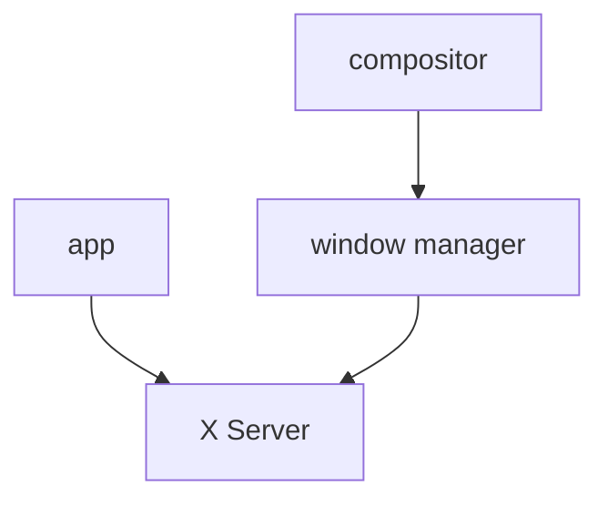
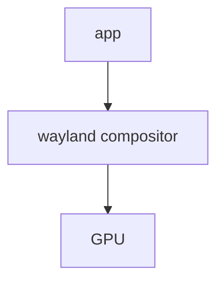

# window manager

## プロトコルの種類
1. X11
1. wayland

## X11の特徴

```mermaid
flowchart TD
id1 --> id2
id3 --> id2
id4 --> id3

id1["app"]
id2["X Server"]
id3["window manager"]
id4["compositor"]
```
1. アプリがXserverに依存
2. 内部のwindow managerもXserverに依存
3. セキュリティが弱い
4. 遅い
## wayland の特徴

```mermaid
flowchart TD
id1 --> id2
id2 --> id3

id1["app"]
id2["wayland compositor"]
id3["GPU"]
```
1. シンプル
2. 速い